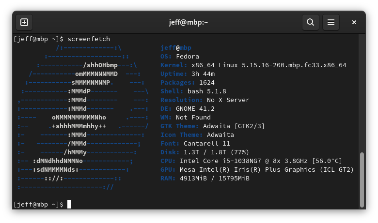

# Install Fedora on MacBook Pro 16,2 with Broadcom 4364 Chipset

## Background

In December 2021, I successfully made Ubuntu 20.04 installed on `MacBook Pro 16,2`. Unfortunately several issues were observed, such as `bluetooth`, `wifi-firmware`, `nautilus` and `nemo` file managers very poor performance or intermittently crashed. I even tried Manjaro with no luck (installed but failed to boot). Then I decided to try Fedora. After running for a week, Fedora on `MacBook Pro 16,2` is really robust, stable, flexible, with bringing confidence and freedom. Happy.



## Hardware Spec

On macOS,

```sh
ioreg -l | grep RequestedFiles

"RequestedFiles" = ({
  "Firmware"="C-4364__s-B3/trinidad.trx",
  "TxCap"="C-4364__s-B3/trinidad-X3.txcb",
  "Regulatory"="C-4364__s-B3/trinidad-X3.clmb",
  "NVRAM"="C-4364__s-B3/P-trinidad-X3_M-HRPN_V-u__m-7.7.txt"
  })
```

On Linux,

```sh
[jeff@mbp ~]$ sudo dmidecode | grep "Product Name"
[sudo] password for jeff:
	Product Name: MacBookPro16,2

[jeff@mbp ~]$ lspci -vvnn | grep -i network
e5:00.0 Network controller [0280]: Broadcom Inc. and subsidiaries
BCM4364 802.11ac Wireless Network Adapter [14e4:4464] (rev 04)
```

## Base Installation

Follow up the instruction at https://github.com/mikeeq/mbp-fedora

## Wifi Firmware

According to https://wiki.t2linux.org/guides/wifi/, and upgrade kernel, then output of `modinfo` reads

```sh
[jeff@mbp mbp-fedora]$ modinfo brcmfmac | grep 4387
firmware:       brcm/brcmfmac4387c2-pcie.clm_blob
firmware:       brcm/brcmfmac4387c2-pcie.bin
```

I didn't execute `wifi.sh` because my MacBook gets internet recovered so its disk volume was named differently. [Renaming solution](https://github.com/t2linux/wiki/blob/a4b46a7cfbe7efcbb6a0b6111e22172b0f5c4a77/docs/guides/wifi.md) doesn't work for me.

#### Load firmware

Instead, copying all under [Broadcom BCM4364 firmware](./brcm/) into `/lib/firmware/brcm` on Linux

```sh
sudo modprobe -r brcmfmac && sudo modprobe brcmfmac
```

#### Verify by `journalctl`

```sh
[jeff@mbp ~]$ sudo journalctl -k --grep=brcmfmac

Feb 14 15:16:45 mbp kernel: usbcore: registered new interface driver brcmfmac
Feb 14 15:16:45 mbp kernel: brcmfmac 0000:e5:00.0: enabling device (0000 -> 0002)
Feb 14 15:16:45 mbp kernel: brcmfmac: brcmf_fw_alloc_request: using brcm/brcmfmac4364b3-pcie for chip BCM4364/4
Feb 14 15:16:45 mbp kernel: brcmfmac 0000:e5:00.0: Direct firmware load for brcm/brcmfmac4364b3-pcie.apple,trinidad-HRPN-u-7.7-X3.bin failed with error -2
Feb 14 15:16:45 mbp kernel: brcmfmac 0000:e5:00.0: Direct firmware load for brcm/brcmfmac4364b3-pcie.apple,trinidad-HRPN-u-7.7.bin failed with error -2
Feb 14 15:16:45 mbp kernel: brcmfmac 0000:e5:00.0: Direct firmware load for brcm/brcmfmac4364b3-pcie.apple,trinidad-HRPN-u.bin failed with error -2
Feb 14 15:16:45 mbp kernel: brcmfmac 0000:e5:00.0: Direct firmware load for brcm/brcmfmac4364b3-pcie.apple,trinidad-HRPN.bin failed with error -2
Feb 14 15:16:45 mbp kernel: brcmfmac 0000:e5:00.0: Direct firmware load for brcm/brcmfmac4364b3-pcie.apple,trinidad-X3.bin failed with error -2
Feb 14 15:16:46 mbp kernel: brcmfmac: brcmf_c_process_txcap_blob: TxCap blob found, loading
Feb 14 15:16:46 mbp kernel: brcmfmac: brcmf_c_preinit_dcmds: Firmware: BCM4364/4 wl0: Jul 12 2021 18:02:56 version 9.30.464.0.32.5.76 FWID 01-c081cfed
```

#### Check Loaded Modules

```sh
[jeff@mbp ~]$ lsmod | grep brcm
brcmfmac              356352  0
brcmutil               16384  1 brcmfmac
cfg80211             1036288  1 brcmfmac
mmc_core              196608  1 brcmfmac
[jeff@mbp ~]$ modinfo brcmfmac
filename:       /lib/modules/5.16.8-200.mbp.fc33.x86_64/kernel/drivers/net/wireless/broadcom/brcm80211/brcmfmac/brcmfmac.ko.xz
license:        Dual BSD/GPL
description:    Broadcom 802.11 wireless LAN fullmac driver.
author:         Broadcom Corporation
firmware:       brcm/brcmfmac*-sdio.*.bin
firmware:       brcm/brcmfmac*-sdio.*.txt
firmware:       brcm/brcmfmac43752-sdio.clm_blob
```

## Update Kernel

```sh
sudo update_kernel_mbp
```
